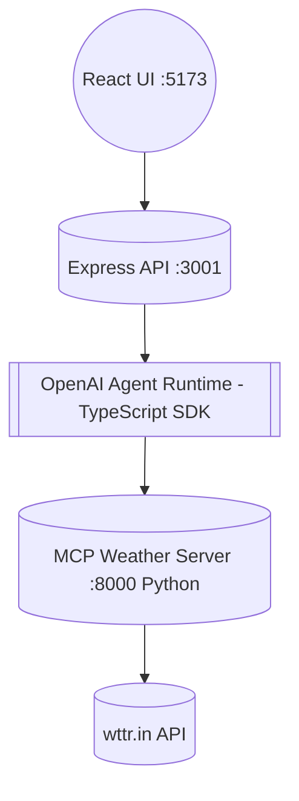
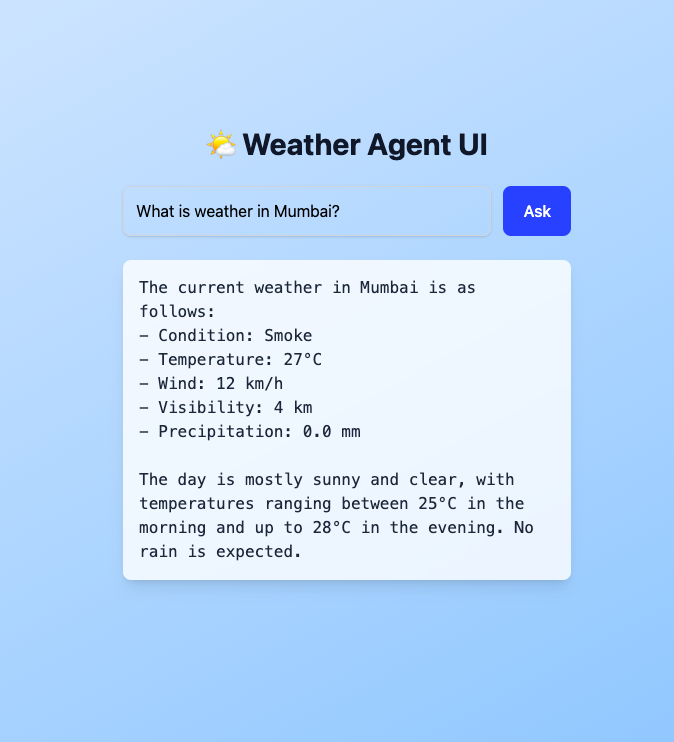

# 📌 OpenAI-MCP-WeatherStack

A **full-stack Weather AI Agent** built using:

- **OpenAI Agents SDK (TypeScript)** as the backend agent runner  
- **Python MCP Server (FastMCP + Requests)** for weather tools  
- **Node Express** to expose the agent to the frontend  
- **React + Vite + Tailwind** as the UI client  

Weather data is fetched in real-time using the **wttr.in API**.

---

# 🚀 Tech Stack

| Layer | Tech |
|---|---|
| MCP Tools | Python • FastMCP • Requests |
| Backend Agent | Node • TypeScript • @openai/agents |
| API Gateway | Express Server |
| Frontend | React • Vite • Tailwind |

# 🏗 Architecture Flow


# 📂 Project Structure

WeatherFullStackMCP
 * [mcp_server.py](./mcp_server.py)              # MCP Weather tool server (Python)
 * [express_server.ts](./express_server.ts)      # Express backend using agent + MCP tools
 * [package.json](./package.json)
 * [tsconfig.json](./tsconfig.json)
 * [.env](./.env)                                # OpenAI API key
 * [.venv](./.venv)                              # Python virtual environment
 * [frontend](./frontend)                        # Vite + React + Tailwind UI

---

# 🔑 Requirements

- Python **3.11+**
- Node **18+**
- npm latest
- OpenAI API Key

---

# 🧪 Setup Instructions

## Clone Project

```bash
git clone https://github.com/omkarwazulkar/OpenAI-MCP-WeatherStack.git
cd OpenAI-MCP-WeatherStack
```

### Step 1: MCP Python Server

- Setup Python MCP Server
```bash
python3 -m venv .venv
source .venv/bin/activate
pip install fastmcp requests
```

- Run MCP Server Command
```bash
python mcp_server.py
```
MCP Server Running : http://localhost:8000/mcp

### Step 2: Node Backend

- Setup Node Backend
```bash
npm install
npm install dotenv
```

- Create .env (Root)
```bash
touch .env
```
- Add:
```bash
OPENAI_API_KEY=your_openai_api_key_here
```

- Run Express Server Command
```bash
npx ts-node express_server.ts
```

Express Server Running : http://localhost:3001/ask

### Step 3: React Frontend

- Setup Frontend UI
```bash
cd frontend
npm install
```

- Run React Command 
```bash
npm run dev
```

Frontend Running : http://localhost:5173

# 💬 Usage

- Open http://localhost:5173 in your browser.

- Enter a message like: 
```bash
What is the weather in New York?
```

- Click "Ask".

- Response:


- Response Path: React → Express → Agent → MCP → Weather API → UI

# ⭐ Features

- Real Weather Retrieval via MCP
- Clean Tailwind UI
- .env Key With dotenv
- Modular Component Structure

# 🤝 Contribute

- Pull Requests Welcome.
- If you like this project, ⭐ star the repo!


