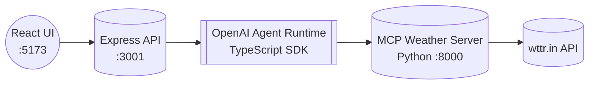

# 📌 WeatherFullStackMCP

A **full-stack Weather AI Agent** built using:

- **OpenAI Agents SDK (TypeScript)** as the backend agent runner  
- **Python MCP Server (FastMCP + Requests)** for weather tools  
- **Node Express** to expose the agent to the frontend  
- **React + Vite + Tailwind** as the UI client  

Weather data is fetched in real-time using the **wttr.in API**.

---

# 🚀 Tech Stack

| Layer | Tech |
|---|---|
| MCP Tools | Python • FastMCP • Requests |
| Backend Agent | Node • TypeScript • @openai/agents |
| API Gateway | Express Server |
| Frontend | React • Vite • Tailwind |

# Architecture Flow

```md


# 📂 Project Structure

WeatherFullStackMCP/
├── mcp_server.py               # MCP Weather tool server (Python)
├── express_server.ts           # Express backend that calls agent + MCP tools
├── package.json
├── tsconfig.json
├── .env                        # OpenAI API key goes here
├── .venv/                      # Python virtual environment
└── frontend/                   # Vite + React + Tailwind UI


---

# 🔑 Requirements

- Python **3.11+**
- Node **18+**
- npm latest
- OpenAI API Key

---

# 🧪 Setup Instructions

## Clone Project

```bash
git clone https://github.com/<your-user>/WeatherFullStackMCP.git
cd WeatherFullStackMCP
```

### Step 1: MCP Python Server

1. Setup Python MCP Server
```bash
python3 -m venv .venv
source .venv/bin/activate
pip install fastmcp requests
```

2. Run MCP Server
Run Command: 
```bash
python mcp_server.py
```
MCP Server Running : http://localhost:8000/mcp

### Step 2: Node Backend

1. Setup Node Backend
```bash
npm install
npm install dotenv
```

2. Create .env (Root)
```bash
touch .env
```
Add:
```bash
OPENAI_API_KEY=your_openai_api_key_here
```

3. Run Express Server
Run Command: 
```bash
npx ts-node express_server.ts
```
Express Server Running : http://localhost:3001/ask

### Step 3: React Frontend

1. Setup Frontend UI
```bash
cd frontend
npm install
```

2. Run React
Run Command: 
```bash
npm run dev
```
Frontend Running : http://localhost:5173

💬 Usage

Open http://localhost:5173 in your browser.
Enter a message like: What is the weather in New York?
Response:

Response Path: React → Express → Agent → MCP → Weather API → UI

⭐ Features

Real Weather Retrieval via MCP
Clean Tailwind UI
.env Key With dotenv
Modular Component Structure

🤝 Contribute

Pull requests welcome.
If you like this project, ⭐ star the repo!


